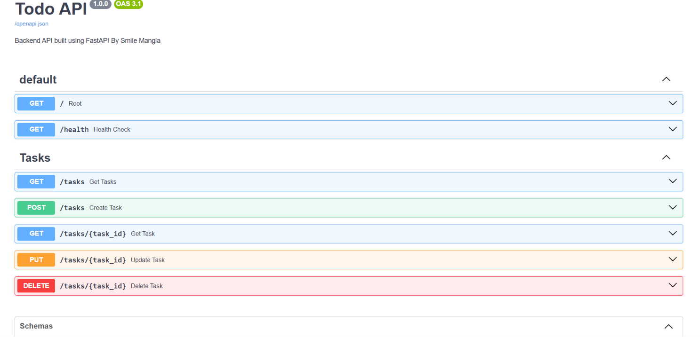

# 🚀 CRUD Todo API using FastAPI

A simple CRUD (Create, Read, Update, Delete) REST API built using **FastAPI** .

This project demonstrates the fundamentals of backend API development, request validation using Pydantic, HTTP exception handling, and interactive API documentation with Swagger UI.

---

## 📌 Features

- ✅ Create a Task
- ✅ Get All Tasks
- ✅ Get Task by ID
- ✅ Update an Existing Task
- ✅ Delete a Task
- ✅ Request Validation using Pydantic
- ✅ Interactive Swagger UI Documentation
- ✅ HTTP Status Codes & Error Handling

---

## 🛠 Tech Stack

- Python 3
- FastAPI
- Pydantic
- Uvicorn
- Git & GitHub

---

# 📂 Project Structure

```
CRUD-API/
│
├── images/
│   └── swagger-ui.png
│
├── .gitignore
├── README.md
├── myapi.py
└── requirements.txt
```

---

# ⚙️ Installation

### Clone the Repository

```bash
git clone https://github.com/smilemangla0310/CRUD-API.git
```

Move into the project directory

```bash
cd CRUD-API
```

---

### Create Virtual Environment

Windows

```bash
python -m venv venv
```

Activate the virtual environment

```bash
venv\Scripts\activate
```

---

### Install Dependencies

```bash
pip install -r requirements.txt
```

---

### Run the API

```bash
uvicorn myapi:app --reload
```

The server will start at

```
http://127.0.0.1:8000
```

---

# 📖 API Documentation

Swagger UI

```
http://127.0.0.1:8000/docs
```

ReDoc

```
http://127.0.0.1:8000/redoc
```

---

# 📌 API Endpoints

| Method | Endpoint | Description |
|---------|----------|-------------|
| GET | `/` | Root Endpoint |
| GET | `/health` | Health Check |
| GET | `/tasks` | Get All Tasks |
| GET | `/tasks/{task_id}` | Get Task by ID |
| POST | `/tasks` | Create a New Task |
| PUT | `/tasks/{task_id}` | Update an Existing Task |
| DELETE | `/tasks/{task_id}` | Delete a Task |

---

# 📄 Example cURL Request

### Request

```bash
curl -i http://127.0.0.1:8000/tasks
```

### Response

```http
HTTP/1.1 200 OK
date: Fri, 17 Jul 2026 16:58:02 GMT
server: uvicorn
content-length: 148
content-type: application/json

[
  {
    "id": 2,
    "title": "Practice and understand The FastAPI Framework",
    "done": false
  },
  {
    "id": 3,
    "title": "Complete the Todo List API Assignment",
    "done": true
  }
]
```

---

# 📸 Swagger UI



---

# 🎯 Learning Outcomes

Through this project, I learned:

- Building REST APIs using FastAPI
- Creating CRUD operations
- Using Pydantic models for request validation
- Handling HTTP exceptions and status codes
- Testing APIs with Swagger UI
- Managing Python virtual environments
- Using Git and GitHub for version control
- Writing project documentation using Markdown

---

# 👩‍💻 Author

**Smile Mangla**

Backend AI Engineering Intern

FlyRank AI

GitHub: https://github.com/smilemangla0310


