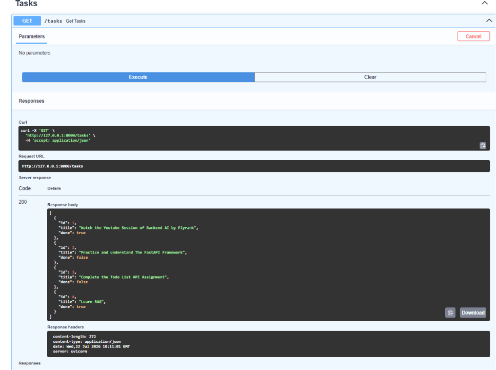
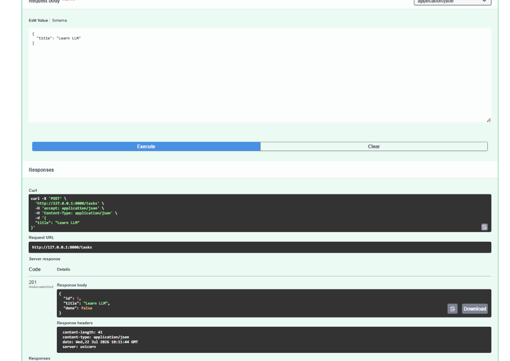
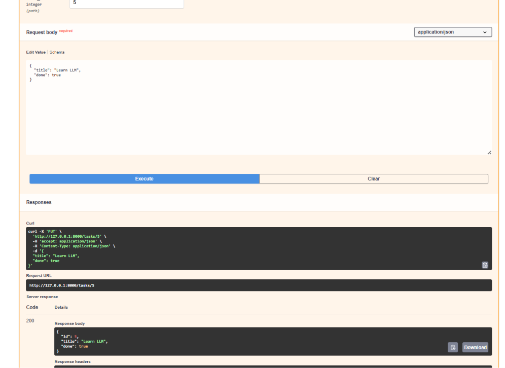
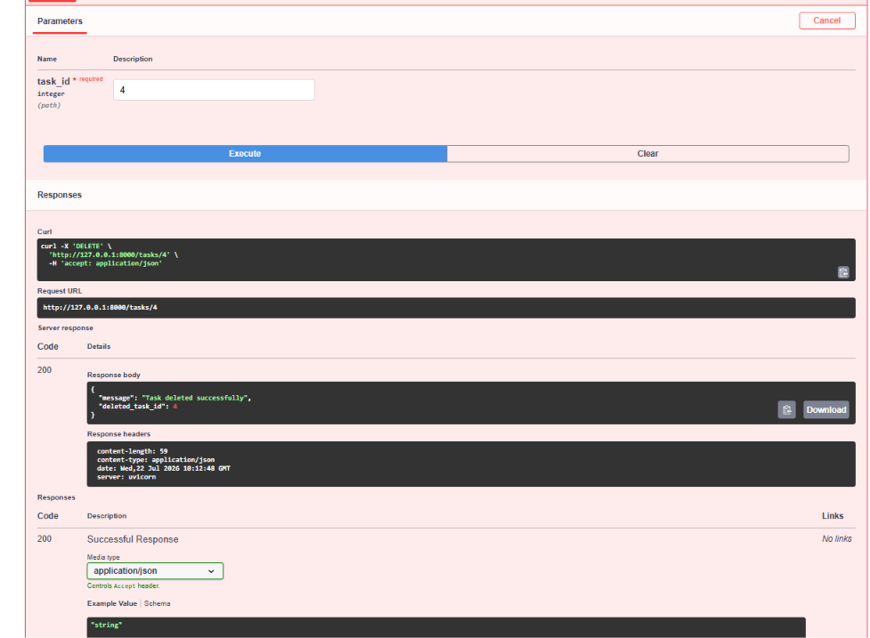

# 🚀 Todo API using FastAPI & SQLite

A beginner-friendly RESTful Todo API built using **FastAPI** and **SQLite**. This project demonstrates CRUD (Create, Read, Update, Delete) operations and uses SQLite as the database for persistent storage.

---

## 📌 Features

- ✅ Create a new task
- ✅ View all tasks
- ✅ View a task by ID
- ✅ Update an existing task
- ✅ Delete a task
- ✅ Persistent data storage using SQLite
- ✅ Interactive API documentation with Swagger UI

---

## 🛠️ Tech Stack

- Python 3
- FastAPI
- SQLite
- Pydantic
- Uvicorn

---

## 📂 Project Structure

```
todo-api-fastapi/
│
├── main.py              # FastAPI application
├── sqlite.py            # Database initialization
├── requirements.txt     # Project dependencies
├── README.md
├── .gitignore
├── images/              # API screenshots
└── tasks.db             # SQLite database (ignored by Git)
```

---

## ⚙️ Installation

### 1. Clone the repository

```bash
git clone https://github.com/your-username/todo-api-fastapi.git
```

### 2. Navigate to the project

```bash
cd todo-api-fastapi
```

### 3. Create a virtual environment

```bash
python -m venv venv
```

### 4. Activate the virtual environment

**Windows**

```bash
venv\Scripts\activate
```

**Mac/Linux**

```bash
source venv/bin/activate
```

### 5. Install dependencies

```bash
pip install -r requirements.txt
```

---

## 🗄️ Initialize the Database

Run the following command once to create the SQLite database and sample tasks.

```bash
python sqlite.py
```

---

## ▶️ Run the API

```bash
uvicorn main:app --reload
```

---

## 📖 API Documentation

Swagger UI

```
http://127.0.0.1:8000/docs
```

ReDoc

```
http://127.0.0.1:8000/redoc
```

---

## 📌 API Endpoints

| Method | Endpoint | Description |
|---------|----------|-------------|
| GET | `/` | Home endpoint |
| GET | `/health` | Health check |
| GET | `/tasks` | Get all tasks |
| GET | `/tasks/{task_id}` | Get a task by ID |
| POST | `/tasks` | Create a new task |
| PUT | `/tasks/{task_id}` | Update a task |
| DELETE | `/tasks/{task_id}` | Delete a task |

---

## 📸 Screenshots

### Swagger UI


### Get Tasks



### Create Task



### Update Task



### Delete Task



---

## 🎯 Learning Outcomes

Through this project, I learned:

- FastAPI fundamentals
- REST API development
- CRUD operations
- SQLite database integration
- SQL queries (SELECT, INSERT, UPDATE, DELETE)
- HTTP status codes
- Pydantic models
- Git & GitHub project management

---

## 👩‍💻 Author

**Smile Mangla**

Aspiring AI & Backend Engineer


---

## ⭐ If you found this project helpful, consider giving it a star!